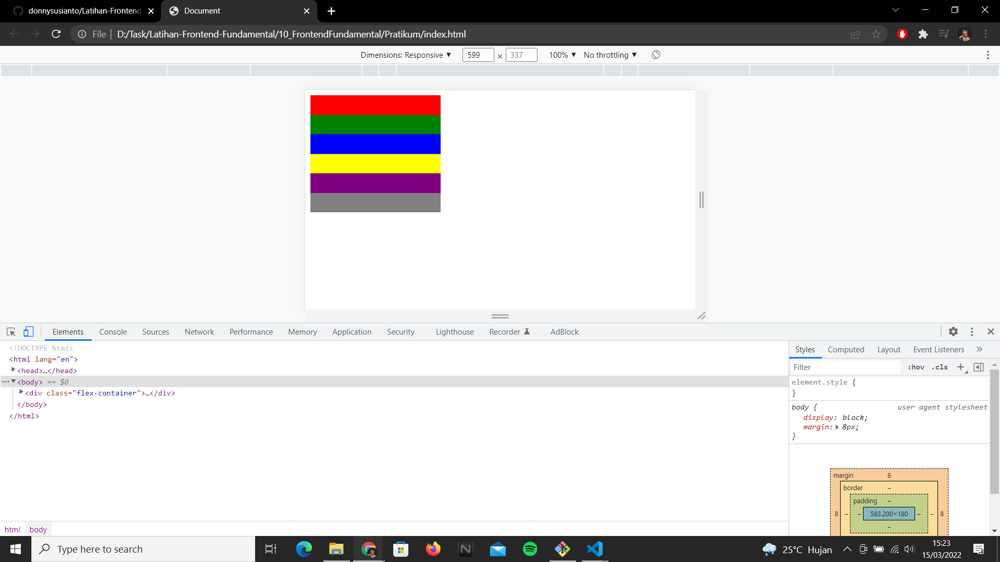
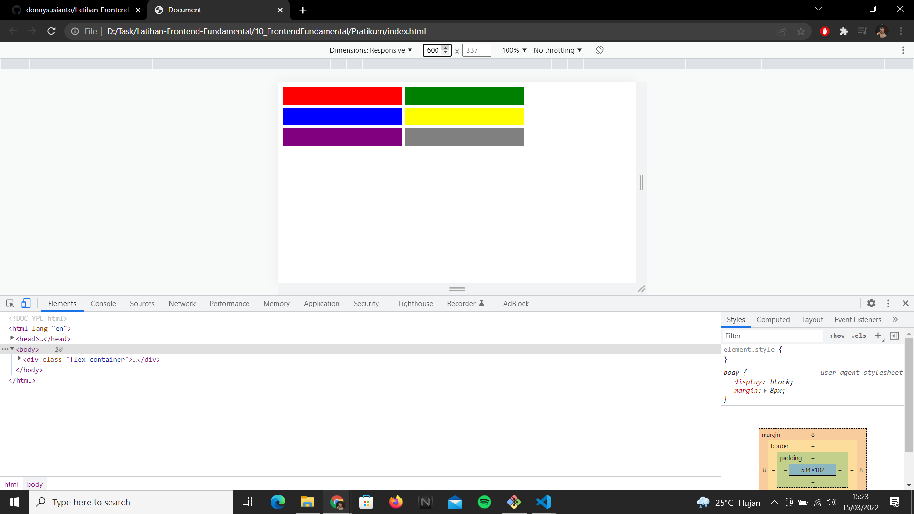
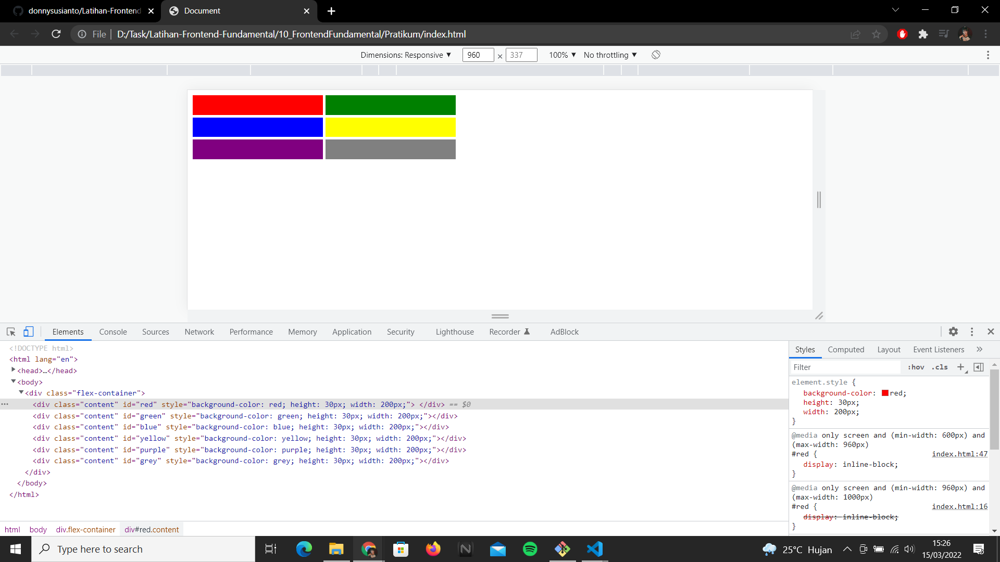
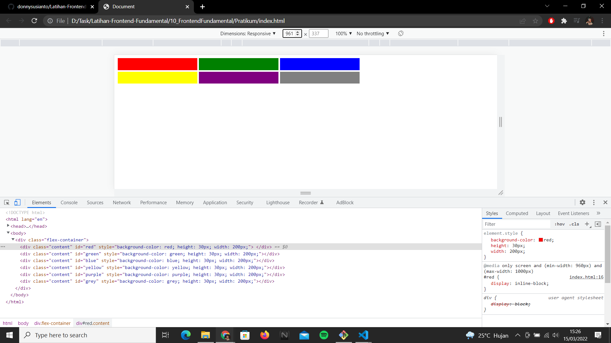

## Resume

dalam materi ini mempelajari:

1. Html
2. Css
3. JavaScript
4. node.js
5. Npm
6. Git

### Html

Html singkatan dari Hypertext Markup Language yang merupakan bahasa standar untuk membuat dan meyusun sebuah web

### Css

Css adalah Kepanjangan dari Cascading Style yang digunakan untuk menjelaskan tampilan sebuah halaman situs web dan mark-up language

### JavaScript

JavaScript adalah bahasa pemrograman yang digunakan dalam pengembangan website agar lebih dinamis dan interaktif.

### Node.js

Node.js adalah runtime environment untuk JavaScript yang bersifat open-source dan cross-platform.

### NPM

NPM adalah Node Package Manager yang berfungsi untuk menginstal dan meng-uninstal package, mengelola versi dan dependensi yang diperlukan untuk menjalankan proyek

### Git

Git adalah salah satu sistem pengontrol versi (Version Control System) yang berguna untuk merekam seubah perubahan-perubahan sistem dari sebuah berkas atau sekumpulan berkas dari waktu ke waktu sehingga Anda dapat menilik kembali versi khusus suatu saat nanti

## Task

### 1. membuat Html dan Css pada sebuah web yang responsive

pada task ini saya membuat Html dan Css pada sebuah web yang responsive

Berikut kode hasil dari pratikum ini.
[index.html](./Pratikum/index.html)

output:

